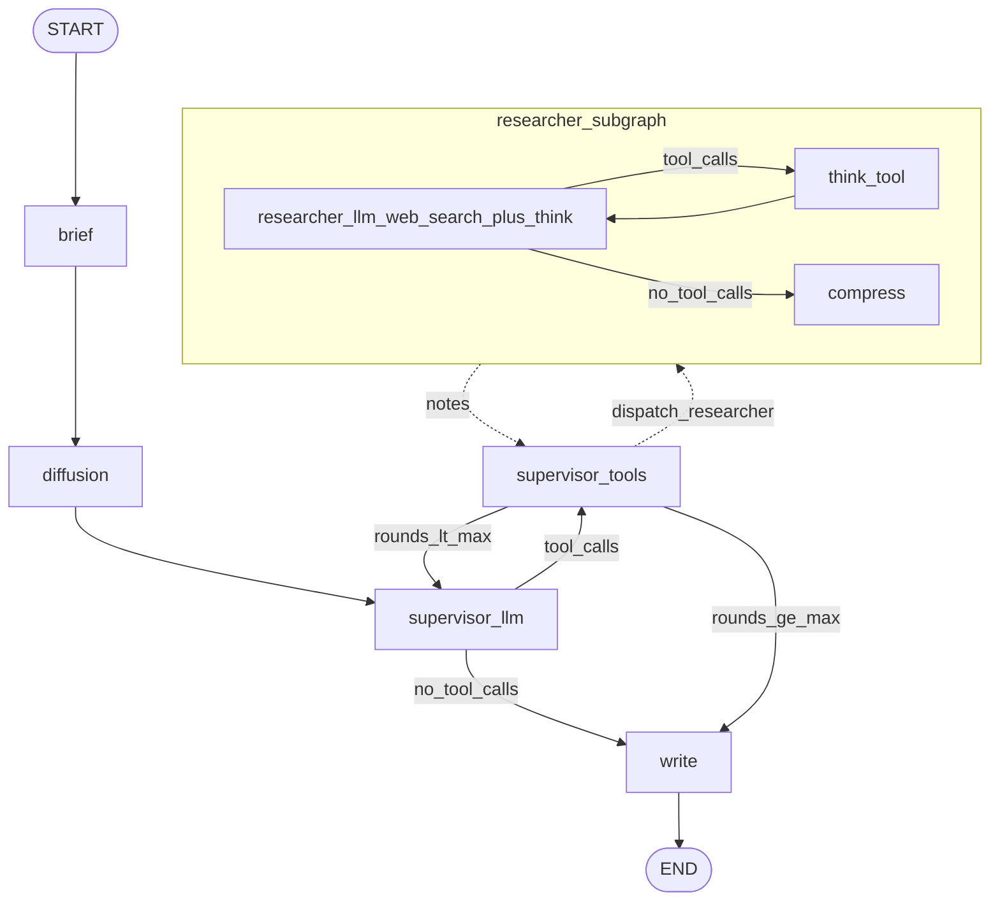

# Deep Research Anatomy

Собраны **типовые паттерны deep research** в виде **минимальной кодовой базы** и **простых системных промптов** — без лишней инфраструктуры, чтобы было проще читать, копировать идеи и собирать свой пайплайн. Репозиторий можно использовать как **опору и вдохновение** при проектировании агентов под исследовательские и аналитические задачи.


## Паттерны и где они в коде

Ниже **девять** паттернов; в репозитории намеренно два режима API: **baseline ReAct** и **одна сборка LangGraph «compound»**, в которой объединены паттерны **#2–#7** (супервайзер с подагентами, бриф, сжатие трейла, запись отчёта, диффузия черновика, think-tool). Паттерны **#8 Steering** и **#9 Verification pipeline** в коде пока не реализованы.

| № | Паттерн | Реализация |
|---|---------|------------|
| 1 | ReAct researcher (baseline) | [`app/agents/react_researcher.py`](app/agents/react_researcher.py) — `ChatAnthropic` + встроенный `web_search_20250305` |
| 2 | Supervisor + Researchers | В составе [`compound`](app/agents/compound_researcher.py): [`supervisor.py`](app/agents/supervisor.py), [`researcher.py`](app/agents/researcher.py) |
| 3 | +Brief | [`brief.py`](app/agents/brief.py) |
| 4 | +Compress | [`compress.py`](app/agents/compress.py) |
| 5 | +Write | [`write.py`](app/agents/write.py) |
| 6 | Diffusion | [`diffusion.py`](app/agents/diffusion.py) |
| 7 | Think tool | [`think.py`](app/agents/think.py) |
| 8 | Steering | Не реализовано (HITL / уточняющие follow-up) |
| 9 | Verification pipeline | Не реализовано |


## Архитектура


Граф compound (упрощённо):




## Быстрый старт

```bash
git clone <URL>
cd deep-research-anatomy
uv sync
```

Создайте файл **`.env`** в корне (в репозиторий не коммитится) с переменными из [`app/settings.py`](app/settings.py):

| Переменная | Назначение |
|------------|------------|
| `ANTHROPIC_API_KEY` | Ключ API Anthropic |
| `LANGFUSE_PUBLIC_KEY`, `LANGFUSE_SECRET_KEY` | Доступ к Langfuse |
| `LANGFUSE_BASE_URL` | Опционально; по умолчанию `http://localhost:3000` |
| `ANTHROPIC_BASE_URL` | Опционально; прокси или совместимый endpoint |

Запуск:

```bash
uv run python -m app.main
# или
uv run uvicorn app.main:app --reload --host 127.0.0.1 --port 8000
```

По умолчанию [`app/main.py`](app/main.py) слушает **127.0.0.1:8000**. Интерактивная схема API: [http://127.0.0.1:8000/docs](http://127.0.0.1:8000/docs).
