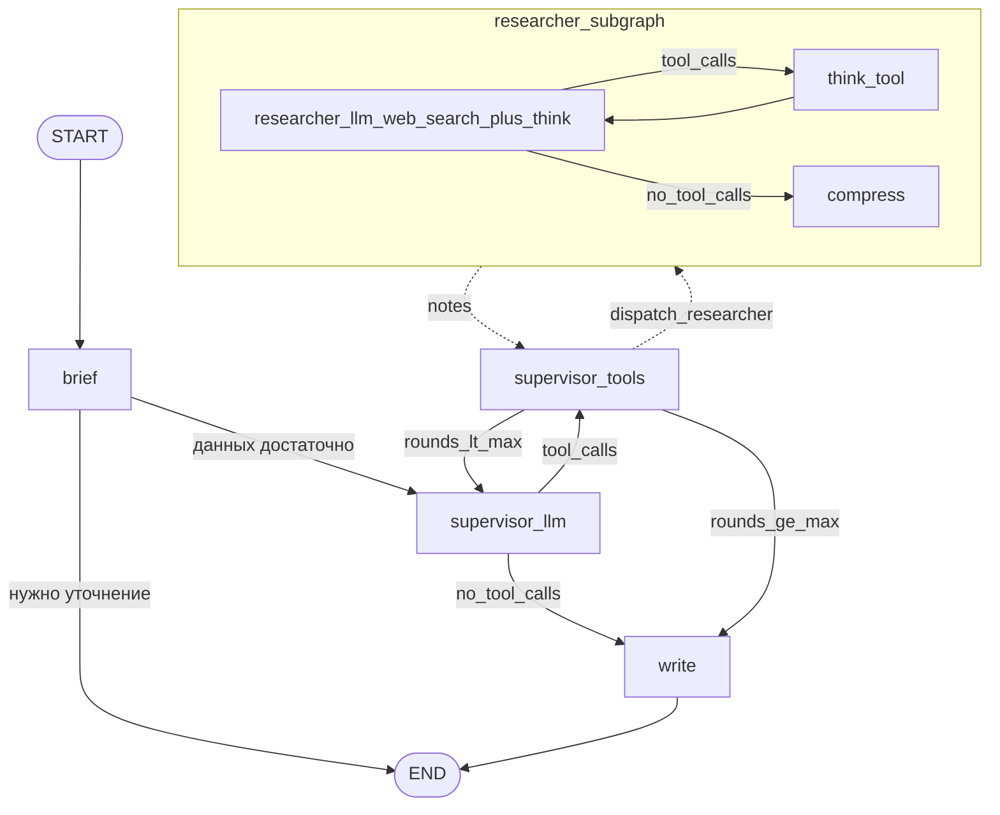

# Deep Research Anatomy

Собраны **типовые паттерны deep research** в виде **минимальной кодовой базы** и **простых системных промптов** — без лишней инфраструктуры, чтобы было проще читать, копировать идеи и собирать свой пайплайн. Репозиторий можно использовать как **опору и вдохновение** при проектировании агентов под исследовательские и аналитические задачи.


## Паттерны и где они в коде

Ниже **девять** паттернов; в репозитории три режима API: **baseline ReAct**, изолированный **«supervisor_researcher»** (чистый паттерн #2) и **сборка LangGraph «compound»**, в которой объединены паттерны **#2–#5 и #7** (супервайзер с подагентами, бриф, сжатие трейла, запись отчёта, think-tool). Паттерны **#6 Diffusion**, **#8 Steering** и **#9 Verification pipeline** в коде пока не реализованы.

| № | Паттерн | Реализация |
|---|---------|------------|
| 1 | ReAct researcher (baseline) | [`app/agents/react_researcher.py`](app/agents/react_researcher.py) — `ChatAnthropic` + встроенный `web_search_20250305` |
| 2 | Supervisor + Researchers | Самостоятельный режим `supervisor_researcher` ([`supervisor_researcher.py`](app/agents/supervisor_researcher.py)): супервайзер раздаёт задачи и сам пишет финал, researcher переиспользует ReAct (#1). Также в составе [`compound`](app/agents/compound_researcher.py): [`supervisor.py`](app/agents/supervisor.py), [`researcher.py`](app/agents/researcher.py) |
| 3 | +Brief | [`brief.py`](app/agents/brief.py) — с HITL-уточнением: при нехватке данных brief возвращает вопрос пользователю (Command-handoff в `END`) вместо запуска поиска |
| 4 | +Compress | [`compress.py`](app/agents/compress.py) |
| 5 | +Write | [`write.py`](app/agents/write.py) |
| 6 | Diffusion | Не реализовано (draft-скелет ответа с маркерами `[RESEARCH_NEEDED]`) |
| 7 | Think tool | [`think.py`](app/agents/think.py) |
| 8 | Steering | Не реализовано (runtime-steering: `interrupt` между итерациями супервайзера). Уточнение на этапе brief — см. #3 |
| 9 | Verification pipeline | Не реализовано |


## Архитектура


Граф compound (упрощённо):


```mermaid
flowchart TD
    Start([START])
    Start --> Brief[brief]
    Brief -->|нужно уточнение| End([END])
    Brief -->|данных достаточно| SupLLM[supervisor_llm]
    SupLLM -->|tool_calls| Tools[supervisor_tools]
    SupLLM -->|no_tool_calls| Write[write]
    Tools -->|rounds_lt_max| SupLLM
    Tools -->|rounds_ge_max| Write
    Write --> End([END])

    subgraph Researcher [researcher_subgraph]
        RLLM[researcher_llm_web_search_plus_think]
        RTools[think_tool]
        Compress[compress]
        RLLM -->|tool_calls| RTools
        RTools --> RLLM
        RLLM -->|no_tool_calls| Compress
    end

    Tools -.dispatch_researcher.-> Researcher
    Researcher -.notes.-> Tools
```


## Быстрый старт

```bash
git clone <URL>
cd deep-research-anatomy
uv sync
```

Создайте файл **`.env`** в корне (в репозиторий не коммитится) с переменными из [`app/settings.py`](app/settings.py):

| Переменная | Назначение |
|------------|------------|
| `ANTHROPIC_API_KEY` | Ключ API Anthropic |
| `LANGFUSE_PUBLIC_KEY`, `LANGFUSE_SECRET_KEY` | Доступ к Langfuse |
| `LANGFUSE_BASE_URL` | Опционально; по умолчанию `http://localhost:3000` |
| `ANTHROPIC_BASE_URL` | Опционально; прокси или совместимый endpoint |

### Langfuse

Для запуска **нужен Langfuse** — через него идёт трейсинг, ключи `LANGFUSE_*`
обязательны. Можно взять управляемое облако
([cloud.langfuse.com](https://cloud.langfuse.com), тогда задайте
`LANGFUSE_BASE_URL=https://cloud.langfuse.com`) либо поднять локально через
Docker Compose ([docs](https://langfuse.com/self-hosting/deployment/docker-compose)):

```bash
git clone https://github.com/langfuse/langfuse.git
cd langfuse
docker compose up
```

UI откроется на `http://localhost:3000` (совпадает с дефолтным `LANGFUSE_BASE_URL`).
Создайте аккаунт, организацию и проект, затем в настройках проекта сгенерируйте
API-ключи и пропишите их в `.env` (`LANGFUSE_PUBLIC_KEY`, `LANGFUSE_SECRET_KEY`).
Self-hosted-вариант через `docker compose up` рассчитан на локальную разработку;
для прода см. документацию Langfuse.

Запуск:

```bash
uv run python -m app.main
# или
uv run uvicorn app.main:app --reload --host 127.0.0.1 --port 8000
```

По умолчанию [`app/main.py`](app/main.py) слушает **127.0.0.1:8000**. Интерактивная схема API: [http://127.0.0.1:8000/docs](http://127.0.0.1:8000/docs).
